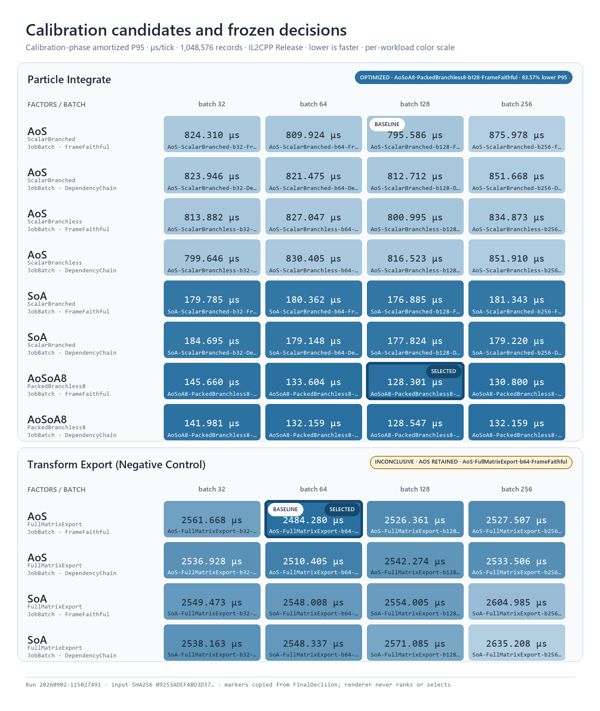
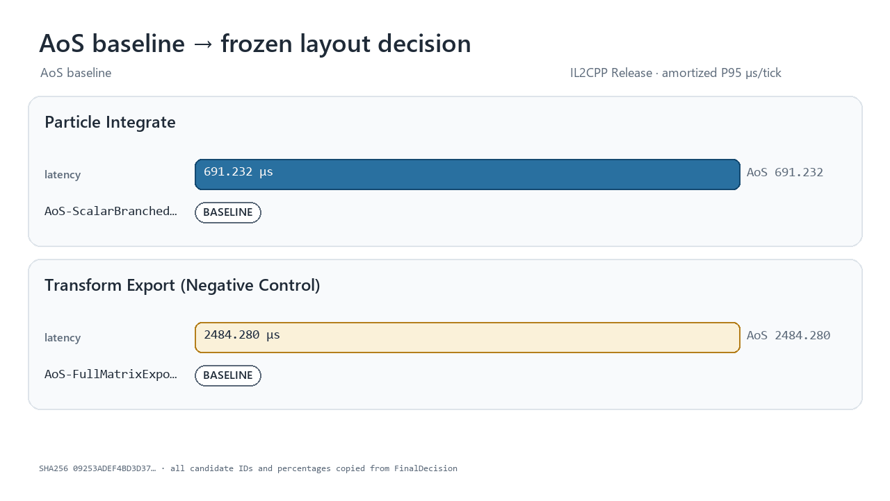

# vNext formal IL2CPP evidence — 2026-09-02

This directory retains all five process launches required by the
[preregistered vNext protocol](../VNEXT_FORMAL_BENCHMARK_PROTOCOL_2026-09-02.md).
The Player was built from implementation commit `c84cf47b62f28b26c34d72acaf16ace23f674ddb`;
the protocol was committed before `run-01`. `run-01` remains the primary result
regardless of its rank, and runs 02–05 remain unfiltered robustness replications.

## ParticleIntegrate holdout

| Run | Tuned AoS | Frozen selection | Lower amortized P95 | 95% paired-block CI | Reciprocal-latency equivalent |
| --- | --- | --- | ---: | ---: | ---: |
| run-01, primary | `AoS / ScalarBranched / b128 / FrameFaithful` | `AoSoA8 / PackedBranchless8 / b128 / FrameFaithful` | 83.57% | [83.14%, 84.57%] | 6.08x |
| run-02 | `AoS / ScalarBranched / b256 / FrameFaithful` | `AoSoA8 / PackedBranchless8 / b256 / DependencyChain` | 83.60% | [82.69%, 84.50%] | 6.10x |
| run-03 | `AoS / ScalarBranchless / b256 / DependencyChain` | `AoSoA8 / PackedBranchless8 / b256 / FrameFaithful` | 83.36% | [83.10%, 84.48%] | 6.01x |
| run-04 | `AoS / ScalarBranchless / b128 / DependencyChain` | `AoSoA8 / PackedBranchless8 / b256 / DependencyChain` | 83.63% | [83.25%, 85.53%] | 6.11x |
| run-05 | `AoS / ScalarBranchless / b256 / DependencyChain` | `AoSoA8 / PackedBranchless8 / b256 / DependencyChain` | 82.96% | [82.45%, 83.87%] | 5.87x |

Across the five fresh launches, the holdout amortized-P95 reduction ranged from
82.96% to 83.63%, with an 83.57% median. The worst per-run confidence lower
bound was 82.45%. The reciprocal-latency figures are derived from `1 / (1 -
reduction)`; they are not direct fixed-budget throughput measurements.

The selected layout/kernel pair was `AoSoA8 / PackedBranchless8` in 5/5 launches,
while batch and execution topology varied. That is evidence for a stable measured
region on this configuration, not proof that one candidate is universal.

## Correctness, negative control, and audit

- All 240 calibration candidate results completed, passed typed parity, and
  recorded zero resident and boundary managed allocation.
- Both Particle holdout candidates completed and passed the same gates in every
  launch: 10/10 holdout candidate results.
- ParticleIntegrate selected a non-AoS candidate in 5/5 launches and confirmed
  it on each untouched holdout without retuning.
- TransformExport retained a tuned AoS candidate in 5/5 launches, preserving the
  intended negative control.
- An independent audit rehashed every suite, checked every preregistered setting,
  and recomputed amortized P95 plus the headline improvement from raw arrays.
- Renderer `1.2.0` read only the fixed `run-01` suite. Its manifest repeats the
  exact input hash and copied `FinalDecision` fields.

The first orchestration attempt stopped before creating `run-01` because of a
preflight-script type error. After that was fixed, the five retained Player
launches ran sequentially. A post-run validator was then corrected to recognize
the negative control's intentionally absent holdout objects; `run-01` itself had
already exited 0 and was retained unchanged. No Player launch was discarded,
replaced, or rerun because of its measured outcome.

## Scope and environment

These results are from five fresh IL2CPP Release/Burst AOT Player processes on
one Windows 11 device with an AMD Ryzen 9 9950X, 7 Unity Job workers, Unity
6000.5.3f1, Burst 1.8.29, 1,048,576 calibration records, and a 1,000,003-record
holdout. They are same-device process replications, not cross-device, cross-ISA,
hardware-counter, or causal-mechanism evidence.

The Balanced power plan was active. A separate Unity Editor and Asset Import
Worker remained open but were effectively idle: the recorded aggregate CPU use
over each five-second preflight ranged from 0.000 to 0.094 CPU seconds. The
preflight files are retained so that this context is visible; the result should
not be described as an absolutely uncontended laboratory run.

Each suite contains the environment, fixed configuration, raw samples, all
candidate results, and frozen decisions. File hashes and exact copied decisions
are listed in [`formal-run-manifest.json`](formal-run-manifest.json).
