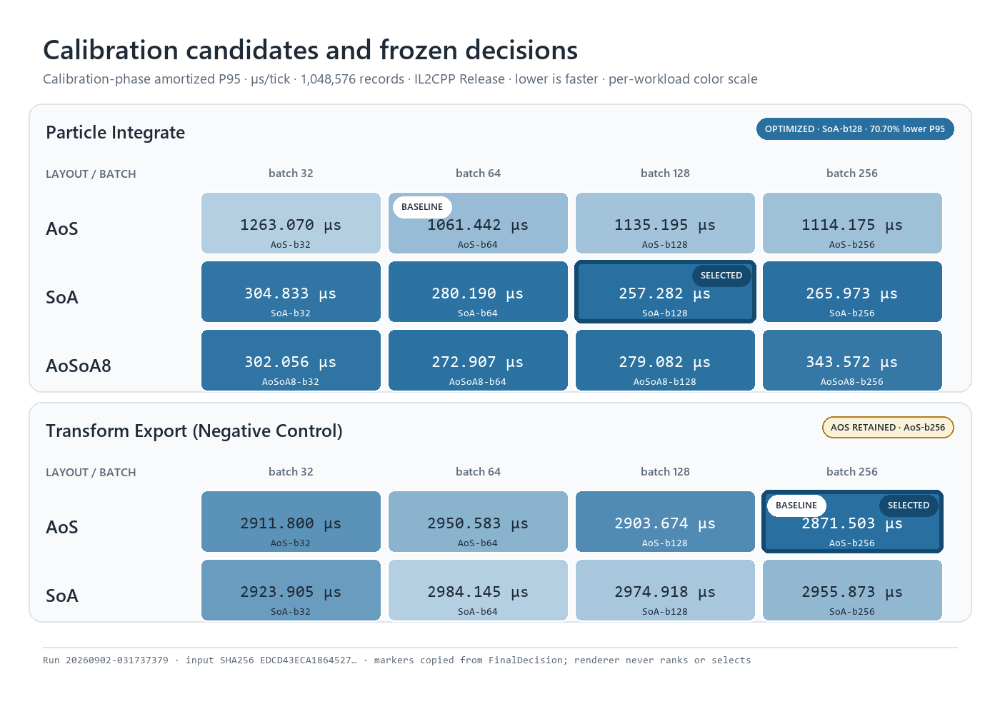
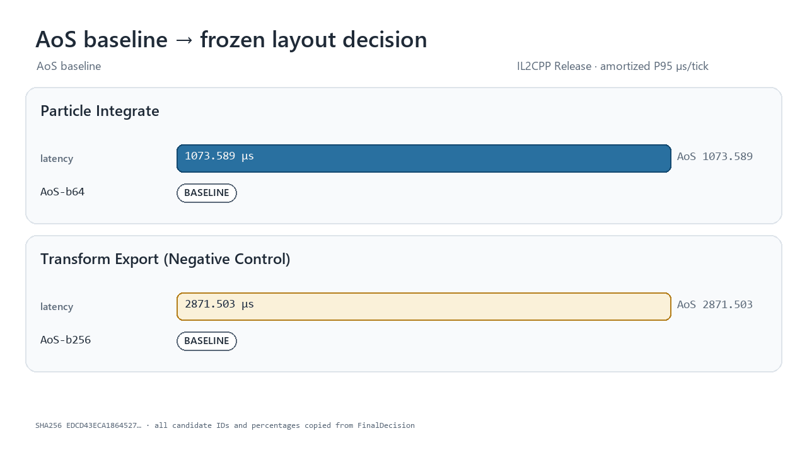

# Data Layout Calibrator

Data Layout Calibrator is a reusable Unity/Burst calibration pipeline for comparing concrete data-layout implementations under one declared semantic contract. It does not rewrite arbitrary project code and does not claim to outsmart Burst. A workload plugin supplies concrete AOT-visible candidates; the core measures them, rejects incorrect or allocating variants, and falls back to AoS unless the evidence clears every gate.

The repository is independent from any product project. Its source is visible
for portfolio review and authorship verification, but remains proprietary and
All Rights Reserved; see [LICENSE](LICENSE).

## What is reusable

The core UPM assembly contains no Particle types. It exposes four plugin boundaries:

- `ICalibrationScenarioFactory` / `ICalibrationScenario`: deterministic input, candidate set, and workload identity.
- `ICalibrationCandidate`: one concrete layout plus literal Burst schedule sites.
- `IParityValidator`: typed, field-level comparison of canonical exports.
- `IBoundaryCost`: allocation-free full ingress and export operations.

`ScenarioCalibrationEngine` drives any implementation of those contracts. Workload code lives in separate Sample assemblies:

- `particle-integrate-v2`: AoS, SoA, and explicit eight-lane AoSoA8; batch 32/64/128/256.
- `transform-export-v1`: AoS and SoA full matrix export; deliberately retained as a negative control.

An assembly-level registration attribute and packaged Roslyn Source Generator create
the runtime factory registry as direct constructor calls. The unreleased vNext
generator also emits bounded storage/codec scaffolds for explicitly annotated flat
records. It still does not rewrite workload kernels, infer semantics, or claim a
compiler optimization.

## Frozen decision rule

The primary value for each candidate is:

```text
amortized P95 ms/tick = resident P95
                      + (ingress P95 + export P95) / declared lifetime ticks
```

The baseline is the fastest valid AoS batch, not a deliberately weak default. A non-AoS candidate is selected only when it:

1. passes field-level parity and state-hash checks;
2. allocates 0 managed bytes in resident, ingress, and export samples;
3. improves amortized P95 by at least 10%;
4. has a 95% confidence interval whose lower bound is above 0%; and
5. repeats those gates on an untouched seed and count holdout.

Native schema 3 uses paired measurement blocks and a log-ratio bootstrap; published
schema-2 artifacts retain their historical independent estimator. An interval that
spans zero is `StatisticalTie`, a statistically slower candidate is `Regression`,
and a positive but sub-threshold point estimate is `Inconclusive`. All select AoS.

## Repository layout

```text
Packages/com.yanagisawa.data-layout-calibrator/
  Runtime/                         workload-agnostic protocol, engine, statistics
  Samples/ParticleIntegrate/       particle plugin and tests
  Samples/TransformExport/         negative-control plugin and tests
  SourceGenerators/                packaged Roslyn analyzer DLL
  SourceGenerators~/               generator source and Roslyn tests
BenchmarkProject/                  standalone Release Player and evidence writer
Tools/ResultRenderer/               fixed-result PNG/GIF renderer and tests
Tools/EvidenceLab/                  planning and retained-artifact evidence verifier
Docs/                              contracts, ADRs, fixed evidence, rendered assets
```

## Build and run

The committed validation project uses Unity `6000.5.3f1`.

```powershell
Unity.exe -batchmode -projectPath BenchmarkProject `
  -runTests -testPlatform EditMode -testResults editmode.xml

Unity.exe -batchmode -quit -projectPath BenchmarkProject `
  -executeMethod Yanagisawa.DataLayoutCalibrator.Benchmark.Editor.DataLayoutCalibratorBuild.BuildWindowsMonoAotEvidence

Unity.exe -batchmode -quit -projectPath BenchmarkProject `
  -executeMethod Yanagisawa.DataLayoutCalibrator.Benchmark.Editor.DataLayoutCalibratorBuild.BuildWindowsIl2CppFormal

Builds/windows-x64/mono-aot-evidence/DataLayoutCalibrator.exe `
  -batchmode -nographics -dla-run -dla-quit `
  -dla-count 1048576 -dla-holdout-count 1000003 `
  -dla-samples 40 -dla-boundary-samples 20 `
  -dla-lifetime-ticks 600 -dla-bootstrap-iterations 4000 `
  -dla-output CalibrationResults/run-01

dotnet test Packages/com.yanagisawa.data-layout-calibrator/SourceGenerators~/Tests/Yanagisawa.DataLayoutCalibrator.SourceGenerator.Tests.csproj -c Release

python -m unittest discover Tools/ResultRenderer/tests -v
python Tools/ResultRenderer/render_results.py `
  Docs/evidence/il2cpp-release-calibration-suite.json Docs/assets

python -m unittest discover Tools/EvidenceLab/tests -v
python Tools/EvidenceLab/evidence_lab.py validate `
  Docs/evidence/device-isa-workload-validation-manifest-v1.json
python Tools/EvidenceLab/evidence_lab.py plan `
  Docs/evidence/device-isa-workload-validation-manifest-v1.json `
  --output work/device-validation-plan.json
```

The build fails unless the Burst library contains all ParticleIntegrate and TransformExport job entrypoints. A successful run writes:

- `calibration-suite.json`: immutable suite result and final decisions;
- `<scenario>/profile.json`: scenario-scoped fixed result;
- `<scenario>/samples.csv`: recorded ingress/resident/export samples;
- summaries stating the exact measurement and presentation contract.

Heatmaps and GIFs read `calibration-suite.json`. They may format or filter it, but may not recompute or replace `FinalDecision`. The renderer writes a provenance manifest containing the input SHA-256 and exact copied decision fields.

## Published v0.3 historical gate

For `v0.3.0-preview.1`, the then-current release gate completed: 29/29 Unity
EditMode tests, 4/4 generator tests, 3/3 renderer tests, Mono Release + Burst
AOT, and IL2CPP Release + Burst AOT. Both workload plugins passed parity and
zero-allocation gates in those published Players. This is historical evidence,
not automatic validation of the unreleased vNext tree.

The checked-in IL2CPP integration result is deliberately a short behavioral gate, not a universal hardware performance claim. On this run, ParticleIntegrate selected `AoSoA8-b128` with a 34.15% holdout amortized-P95 improvement; TransformExport retained `AoS-b256`, demonstrating the negative control. The immutable result SHA-256 is `85FAC20CDF81EBA674A3A736340CFCBEEB88EEF99CD1F5ECC776EE0215E53D78`.

A separate [preregistered formal run set](Docs/evidence/formal-il2cpp-2026-09-02/README.md)
retains five sequential, fresh IL2CPP Player processes using 1,048,576
calibration records, 1,000,003 holdout records, 40 resident samples, 20 boundary
samples, and 4,000 bootstrap iterations. The preregistered primary run reduced
ParticleIntegrate holdout P95 by 70.70% versus its tuned AoS baseline, with a
95% CI of [65.32%, 79.37%]. Across all five launches, the reduction ranged from
66.11% to 74.81%; TransformExport retained tuned AoS in 5/5 launches. These are
same-device process replications, not a cross-hardware guarantee.





See the [final validation evidence](Docs/VALIDATION_RESULTS_2026-09-02.md), [calibration contract](Docs/CALIBRATION_CONTRACT.md), and [fixed-result renderer contract](Tools/ResultRenderer/README.md).

## Unreleased vNext integration

The `codex/vnext-05-integration` branch composes the v0.4 scientific foundation,
advantage-envelope/adaptive decision engine, v0.5 generator/profile foundation,
and v0.6 evidence-lab foundation. It freezes canonical candidate hashes and
reuses the scientific paired-bootstrap draws in the envelope. Schema-3 profiles
may reference a locked external envelope; neither the reference nor a renderer
can replace `FinalDecision`.

Deterministic integration checks currently pass 139/139 Unity EditMode tests,
11/11 generator tests, 25/25 renderer tests, and 22/22 Evidence Lab tests. The
planning-only evidence manifest validates with 0 executable requests and 18
blocked cells, exactly because no device, Player artifact, or identity
attestation is configured.

The merged tree now passes non-Development Windows x64 Mono and IL2CPP builds
with Burst AOT entrypoint verification. Tiny opt-in Players on both backends
passed generated-storage/profile reachability, parity, allocation, and schema
gates; their timings are not performance evidence.

A separate [preregistered vNext formal run set](Docs/evidence/vnext-formal-il2cpp-2026-09-02/README.md)
retains five full-size IL2CPP Release/Burst AOT Player launches. The fixed primary
run measured an 83.57% lower ParticleIntegrate holdout amortized P95 than its
tuned AoS baseline, with a per-Player 95% paired-block CI of [83.14%, 84.57%].
Across all five launches, the reduction ranged from 82.96% to 83.63% and
TransformExport retained tuned AoS in 5/5 runs. This is same-device process
evidence, not a hardware-counter, causal, cross-ISA, or cross-device claim.

This branch remains an unreleased foundation at package version
`0.3.0-preview.1`. Roadmap completion still requires the expanded candidate and
causal-control matrix, production generator adoption, formal envelope/adaptive
measurements, a real counter provider, and multi-device/workload evidence. See the
[integration ADR](Docs/adr/0006-vnext-integration-protocol.md) and
[roadmap status](Docs/ROADMAP_V0.4_TO_V0.6.md).

## Citation, authorship, and license

The canonical repository is
[`Yanagisawa2002/data-layout-calibrator`](https://github.com/Yanagisawa2002/data-layout-calibrator).
Machine-readable citation metadata is provided in [`CITATION.cff`](CITATION.cff),
and the project authorship boundary is recorded in [`AUTHORS.md`](AUTHORS.md)
and [`PROVENANCE.md`](PROVENANCE.md).

Copyright (c) 2026 Edwin Liu. All Rights Reserved. Public visibility does not
grant permission to copy, modify, distribute, deploy, or sublicense the code.
