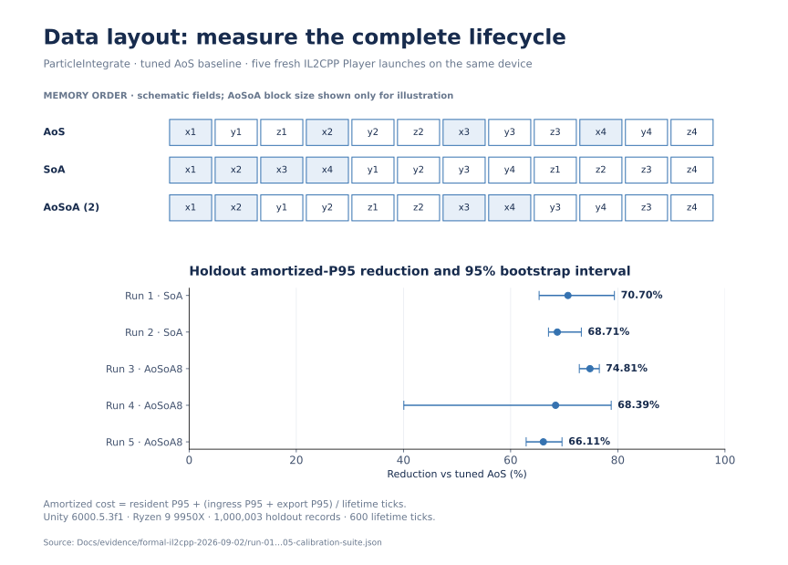

# Data Layout Calibrator

**Choose a Unity/Burst data layout that pays off over the workload's lifetime.**

An efficient resident kernel can still lose once data conversion and export are
included. I built a reusable calibration pipeline that measures those costs and
selects among concrete AoS, SoA and AoSoA implementations.

## Results


- **66.11%–74.81% lower holdout amortized P95** for ParticleIntegrate versus the
  tuned AoS baseline across five fresh IL2CPP Player launches on the same device.
- **AoS retained in 5/5 TransformExport launches**, demonstrating that the
  selector accounts for workloads where conversion/export changes the decision.

[Formal run set, hardware and raw results](Docs/evidence/formal-il2cpp-2026-09-02/README.md).
The comparison includes amortized ingress/export costs; these are same-device
process replications with Unity 6000.5.3f1 and Burst AOT.

## Visual walkthrough

[](Docs/portfolio/overview.png)

Memory-layout schematics explain the design choices; the chart reads each formal run’s recorded final decision and interval. [Sources and reproduction](Docs/portfolio/README.md).

## Engineering challenges

1. **Measure the lifecycle, not just the kernel.** Layout conversion must be
   amortized over the declared number of resident ticks and compared to tuned AoS.
2. **Make the decision reliable.** Candidates must preserve field-level results,
   avoid managed allocations, and repeat the improvement on an untouched holdout.

## My contribution

I implemented the workload-independent calibration engine, layout/sample plugins,
boundary-cost measurement, parity validation, bootstrap decision rules and
AOT-safe registration generator. The result renderer presents the recorded
selection with traceable input hashes.

## Evidence and reproduction

[Validation results](Docs/VALIDATION_RESULTS_2026-09-02.md) ·
[Calibration contract](Docs/CALIBRATION_CONTRACT.md) ·
[Build and run](#build-and-run). Detailed runs and the fixed-result heatmap
remain in the expandable evaluation section.

## What is reusable

The core UPM assembly contains no Particle types. It exposes four plugin boundaries:

- `ICalibrationScenarioFactory` / `ICalibrationScenario`: deterministic input, candidate set, and workload identity.
- `ICalibrationCandidate`: one concrete layout plus literal Burst schedule sites.
- `IParityValidator`: typed, field-level comparison of canonical exports.
- `IBoundaryCost`: allocation-free full ingress and export operations.

`ScenarioCalibrationEngine` drives any implementation of those contracts. Workload code lives in separate Sample assemblies:

- `particle-integrate-v2`: AoS, SoA, and explicit eight-lane AoSoA8; batch 32/64/128/256.
- `transform-export-v1`: AoS and SoA full matrix export; deliberately retained as a negative control.

An assembly-level registration attribute and packaged Roslyn Source Generator create the runtime factory registry as direct constructor calls. The generator is AOT-safe and intentionally narrow: it removes hand-maintained registration without attempting to synthesize layouts or rewrite workload code.

## Frozen decision rule

The primary value for each candidate is:

```text
amortized P95 ms/tick = resident P95
                      + (ingress P95 + export P95) / declared lifetime ticks
```

The baseline is the fastest valid AoS batch, not a deliberately weak default. A non-AoS candidate is selected only when it:

1. passes field-level parity and state-hash checks;
2. allocates 0 managed bytes in resident, ingress, and export samples;
3. improves amortized P95 by at least 10%;
4. has a 95% non-parametric bootstrap confidence interval whose lower bound is above 0%; and
5. repeats those gates on an untouched seed and count holdout.

An insignificant difference is recorded as `StatisticalTie` and selects AoS. A sub-threshold point estimate is `Inconclusive` and also selects AoS.

## Repository layout

```text
Packages/com.yanagisawa.data-layout-calibrator/
  Runtime/                         workload-agnostic protocol, engine, statistics
  Samples/ParticleIntegrate/       particle plugin and tests
  Samples/TransformExport/         negative-control plugin and tests
  SourceGenerators/                packaged Roslyn analyzer DLL
  SourceGenerators~/               generator source and Roslyn tests
BenchmarkProject/                  standalone Release Player and evidence writer
Tools/ResultRenderer/               fixed-result PNG/GIF renderer and tests
Docs/                              contracts, ADRs, fixed evidence, rendered assets
```

## Build and run

The committed validation project uses Unity `6000.5.3f1`.

```powershell
Unity.exe -batchmode -projectPath BenchmarkProject `
  -runTests -testPlatform EditMode -testResults editmode.xml

Unity.exe -batchmode -quit -projectPath BenchmarkProject `
  -executeMethod Yanagisawa.DataLayoutCalibrator.Benchmark.Editor.DataLayoutCalibratorBuild.BuildWindowsMonoAotEvidence

Unity.exe -batchmode -quit -projectPath BenchmarkProject `
  -executeMethod Yanagisawa.DataLayoutCalibrator.Benchmark.Editor.DataLayoutCalibratorBuild.BuildWindowsIl2CppFormal

Builds/windows-x64/mono-aot-evidence/DataLayoutCalibrator.exe `
  -batchmode -nographics -dla-run -dla-quit `
  -dla-count 1048576 -dla-holdout-count 1000003 `
  -dla-samples 40 -dla-boundary-samples 20 `
  -dla-lifetime-ticks 600 -dla-bootstrap-iterations 4000 `
  -dla-output CalibrationResults/run-01

dotnet test Packages/com.yanagisawa.data-layout-calibrator/SourceGenerators~/Tests/Yanagisawa.DataLayoutCalibrator.SourceGenerator.Tests.csproj -c Release

python -m unittest discover Tools/ResultRenderer/tests -v
python Tools/ResultRenderer/render_results.py `
  Docs/evidence/il2cpp-release-calibration-suite.json Docs/assets
```

The build fails unless the Burst library contains all ParticleIntegrate and TransformExport job entrypoints. A successful run writes:

- `calibration-suite.json`: immutable suite result and final decisions;
- `<scenario>/profile.json`: scenario-scoped fixed result;
- `<scenario>/samples.csv`: recorded ingress/resident/export samples;
- summaries stating the exact measurement and presentation contract.

Heatmaps and GIFs read `calibration-suite.json`. They may format or filter it, but may not recompute or replace `FinalDecision`. The renderer writes a provenance manifest containing the input SHA-256 and exact copied decision fields.

<details>
<summary>Evaluation details, tradeoffs and supported scope</summary>

## Measured results and scope

The full roadmap gate is complete: 29/29 Unity EditMode tests, 4/4 generator tests, 3/3 renderer tests, Mono Release + Burst AOT, and IL2CPP Release + Burst AOT. Both workload plugins pass parity and zero-allocation gates in both Players.

The checked-in IL2CPP integration result is deliberately a short behavioral gate, not a universal hardware performance claim. On this run, ParticleIntegrate selected `AoSoA8-b128` with a 34.15% holdout amortized-P95 improvement; TransformExport retained `AoS-b256`, demonstrating the negative control. The immutable result SHA-256 is `85FAC20CDF81EBA674A3A736340CFCBEEB88EEF99CD1F5ECC776EE0215E53D78`.

A separate [preregistered formal run set](Docs/evidence/formal-il2cpp-2026-09-02/README.md)
retains five sequential, fresh IL2CPP Player processes using 1,048,576
calibration records, 1,000,003 holdout records, 40 resident samples, 20 boundary
samples, and 4,000 bootstrap iterations. The preregistered primary run reduced
ParticleIntegrate holdout P95 by 70.70% versus its tuned AoS baseline, with a
95% CI of [65.32%, 79.37%]. Across all five launches, the reduction ranged from
66.11% to 74.81%; TransformExport retained tuned AoS in 5/5 launches. These are
same-device process replications, not a cross-hardware guarantee.


See the [final validation evidence](Docs/VALIDATION_RESULTS_2026-09-02.md), [calibration contract](Docs/CALIBRATION_CONTRACT.md), and [fixed-result renderer contract](Tools/ResultRenderer/README.md).

</details>

## Citation, authorship, and license

The canonical repository is
[`Yanagisawa2002/data-layout-calibrator`](https://github.com/Yanagisawa2002/data-layout-calibrator).
Machine-readable citation metadata is provided in [`CITATION.cff`](CITATION.cff),
and the project authorship boundary is recorded in [`AUTHORS.md`](AUTHORS.md)
and [`PROVENANCE.md`](PROVENANCE.md).

Copyright (c) 2026 Edwin Liu. All other rights reserved. The [limited benchmark
reproduction permission](LICENSE) permits running benchmarks, making local
reproduction changes, and publishing measurement results. It does not grant
general redistribution, sublicensing, or product integration rights.
